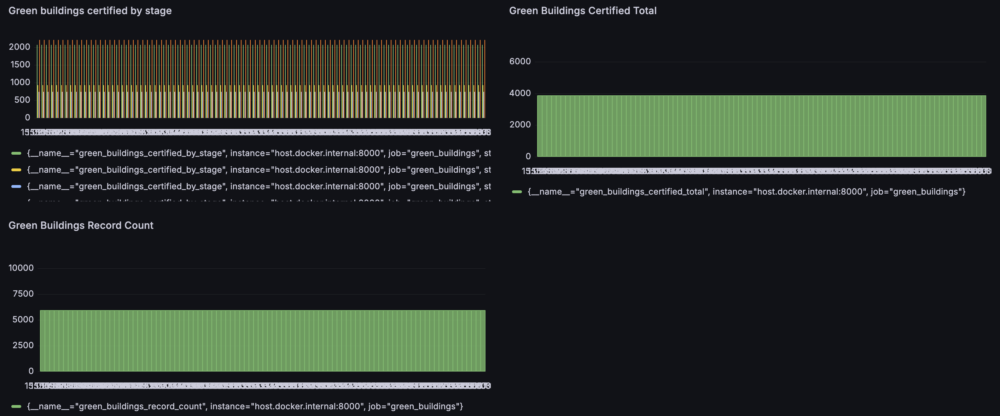

# Green Buildings Metrics Dashboard


**Data Source:**  
[Israel Green Building Certifications Dataset](https://data.gov.il/dataset/greenbuildings/resource/7f467a30-58cd-44b5-86f0-d570cc7d25ad)


This project fetches green building certification data from [data.gov.il](https://data.gov.il/), exposes it as custom Prometheus metrics, and visualizes it live in Grafana.

## How to Run

1. Clone the repository and install Python dependencies:
    ```
    pip install -r requirements.txt
    ```

2. Set the `API_URL` in the `.env` file.

3. Run the Python Prometheus exporter:
    ```
    python main.py
    ```

4. In another terminal, start Prometheus and Grafana:
    ```
    docker-compose up
    ```

5. Access the services:
    - Exporter metrics: [http://localhost:8000/metrics](http://localhost:8000/metrics)
    - Prometheus: [http://localhost:9090](http://localhost:9090)
    - Grafana: [http://localhost:3000](http://localhost:3000)

6. In Grafana, load the **Green Buildings Dashboard** to view real-time metrics.

---

**Technologies Used:**  
- Python 3
- Prometheus
- Grafana
- Docker & Docker Compose

<p align="center">
  
</p>